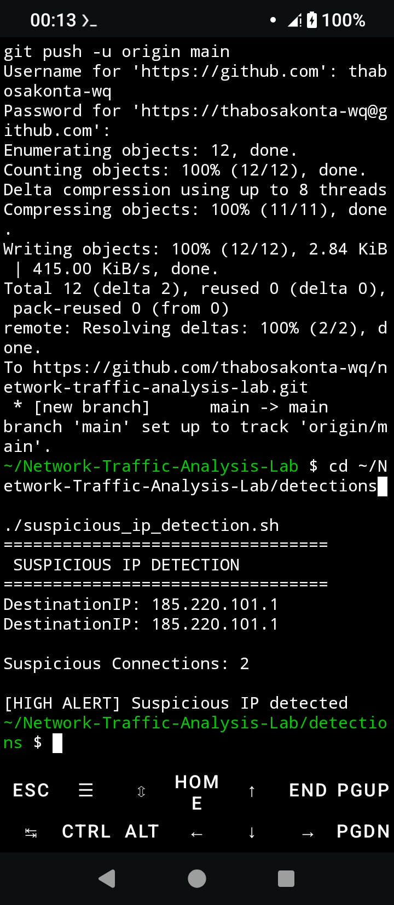
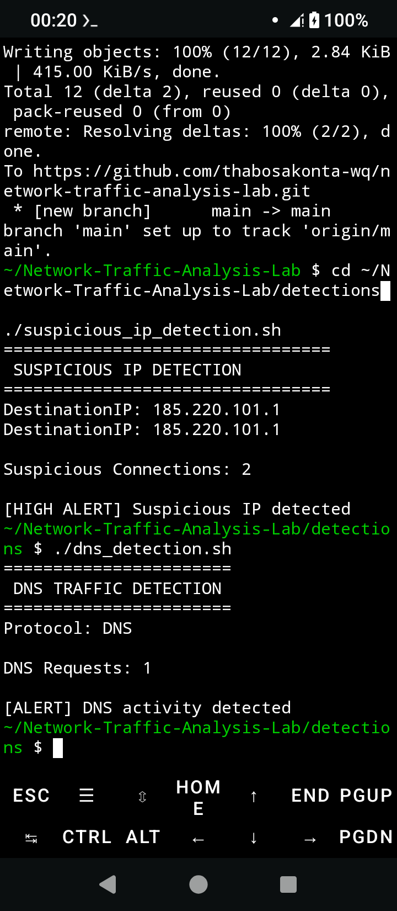
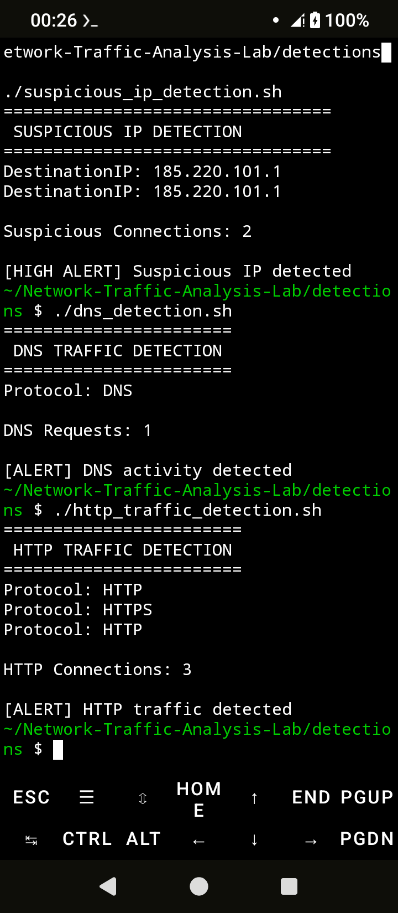

# Network Traffic Analysis Lab

A cybersecurity project focused on network traffic analysis, threat hunting, detection engineering, and MITRE ATT&CK mapping using simulated network logs.

---

## Overview

This lab demonstrates how SOC analysts investigate network communications, identify suspicious traffic, analyze DNS activity, and detect potentially malicious outbound connections.

---

## Features

### Suspicious IP Detection

Detects communications with suspicious external IP addresses.

### DNS Traffic Detection

Identifies DNS activity that may indicate reconnaissance or malware communication.

### HTTP Traffic Detection

Identifies outbound HTTP communications and suspicious web activity.

---

## Screenshots

### Suspicious IP Detection



---

### DNS Traffic Detection



---

### HTTP Traffic Detection



---

## MITRE ATT&CK Coverage

| Technique | Description |
|------------|------------|
| T1071 | Application Layer Protocol |
| T1071.001 | Web Protocols |
| T1046 | Network Service Discovery |

---

## Technologies Used

- Bash
- Linux
- Termux
- Network Traffic Analysis
- MITRE ATT&CK
- Threat Hunting
- Git
- GitHub

---

## Learning Outcomes

- Network Traffic Analysis
- Threat Hunting
- Detection Engineering
- Security Monitoring
- MITRE ATT&CK Mapping
- SOC Operations
- Incident Investigation

---

## Project Structure

```text
Network-Traffic-Analysis-Lab
│
├── detections
├── pcaps
├── reports
│   ├── mitre_mapping.md
│   └── network_investigation_report.txt
├── screenshots
└── README.md
```

---

## Future Enhancements

- Wireshark PCAP Analysis
- Zeek Log Analysis
- DNS Tunneling Detection
- Threat Intelligence Integration
- Automated IOC Detection
- Network Forensics Dashboard

---

## Screenshots

### Suspicious IP Detection


### DNS Traffic Detection


### HTTP Traffic Detection


---

Author
=======
## Author

Thabo Sakonta

Microsoft Certified Security Operations Analyst (SC-200)

GitHub:
https://github.com/thabosakonta-wq

LinkedIn:
https://www.linkedin.com/in/thabo-sakonta-377a3748

---

## License

This project is provided for educational and portfolio purposes.
